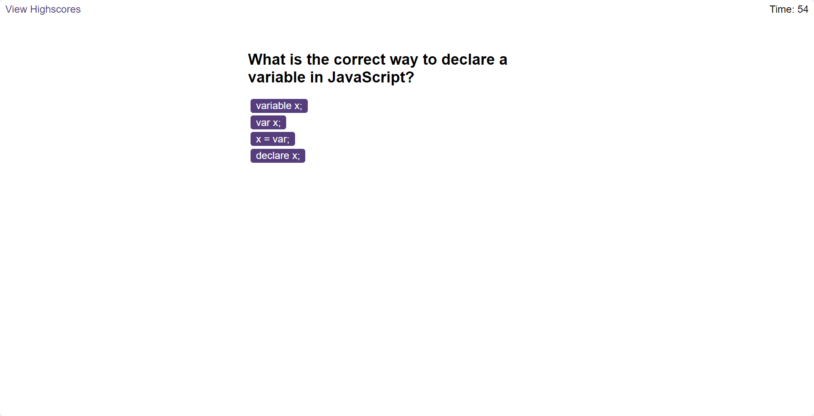

# Quiz

## Overview

This is a simple quiz application implemented in JavaScript. The quiz has a one-minute timer, deducts 10 seconds for each incorrect answer, and provides feedback sounds for correct and incorrect selections. After answering all questions or when the timer reaches 0, users can enter their initials and view the final scores of other players.




## Deployment

The deployed version can be accessed [here](https://borregaio.github.io/quiz/).


## Key Features

- One-minute timer for the entire quiz.

- 10 seconds deduction for each incorrect answer.

- Sounds for correct and incorrect selections.

- Dynamic display of the next question after each answer.

- Final score display with an option to enter initials.


## Usage

1. Clone the repository
    ```console
    git clone https://github.com/borregaio/quiz.git
    ```

2. Open the index.html file in a web browser
    ```console
    cd quiz
    open index.html
    ```

3. Answer the questions within the time limit and enjoy the sounds for correct and incorrect selections.

4. After completing the quiz or when the timer runs out, enter your initials to view the final scores.

## Steps

- **One-minute timer for the entire quiz:**
    ```javascript
    var secondsLeft = 60;

    function setTimer() {
        var timerInterval = setInterval(function () {
            secondsLeft--;

            if (secondsLeft === 0) {
                clearInterval(timerInterval);
                questions.classList.add("hide");
                endScreen.classList.remove("hide");
                finalScore.textContent = score;
            }
            // Set the content of timer to seconds left
            timer.textContent = secondsLeft;

        }, 1000);
    }
    ```

- **10 seconds deduction for each incorrect answer:**
    ```javascript
    function subtractTimeFromTimer(timeToSubtract) {
        if (secondsLeft > timeToSubtract) {
            // Subtract time from the current remaining time
            secondsLeft -= timeToSubtract;
            // Update the timer display immediately
            timer.textContent = secondsLeft;
        } else {
            console.log("Cannot subtract more time than remaining.");
        }
    }
    ```

- **Sounds for correct and incorrect selections:**
    ```javascript
    function correctSound() {
        var audio = new Audio("./assets/sfx/correct.wav");
        audio.play();
    }

    function incorrectSound() {
        var audio = new Audio("./assets/sfx/incorrect.wav");
        audio.play();
    }
    ```

- **Dynamic display of the next question after each answer:**
    ```javascript
    //Function to show the first question and answers
    //Index number for quiz array
    var currentIndex = 0;

    function Question() {
        if (currentIndex < quiz.length) {
            // Change textContent using the current index
            questionTitle.textContent = quiz[currentIndex].question;
            button1.textContent = quiz[currentIndex].answers[0];
            button2.textContent = quiz[currentIndex].answers[1];
            button3.textContent = quiz[currentIndex].answers[2];
            button4.textContent = quiz[currentIndex].answers[3];

            choices.innerHTML = ""; // Clear previous buttons
            choices.appendChild(button1);
            choices.appendChild(button2);
            choices.appendChild(button3);
            choices.appendChild(button4);
        }
    }

    //Function to show the next question
    function nextQuestion() {
        currentIndex++
        Question();

        //Show final score screen quen questions are finished
        if (currentIndex >= quiz.length) {
            questions.classList.add("hide");
            endScreen.classList.remove("hide");
            finalScore.textContent = score;
        }
    }
    ```

- **Final score display with an option to enter initials:**
    ```javascript
    submit.addEventListener("click", function () {
        // Get the user input from the text input
        var userInput = document.getElementById("initials").value;

        // Retrieve existing highscores from local storage
        var existingHighscores = JSON.parse(localStorage.getItem("highscores")) || [];

        // Add the new score object to the highscores array
        existingHighscores.push({ userInitials: userInput.toUpperCase(), score: localStorage.getItem("score") });

        // Store the updated highscores in local storage
        localStorage.setItem("highscores", JSON.stringify(existingHighscores));

        // Change the window location to the desired HTML page
        window.location.href = "highscores.html";
    });

    // Retrieve highscores from local storage
    var highscores = JSON.parse(localStorage.getItem("highscores")) || [];

    // Get the ul element where the highscores will be displayed
    var highscoresList = document.getElementById("highscores");

    // Iterate through the highscores and create an li element for each
    highscores.forEach(function(scoreObj) {
        var listItem = document.createElement("li");
        listItem.textContent = scoreObj.userInitials + " - Score: " + scoreObj.score;
        highscoresList.appendChild(listItem);
    });
    ```

- **Testing:**
   - Verified that the website maintains its visual consistency after the refactoring and loads with no errors.